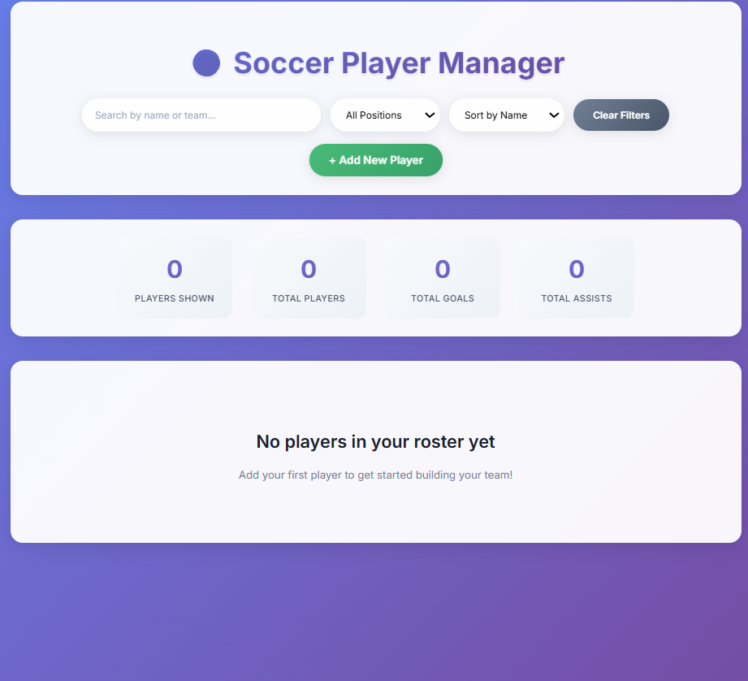

# ⚽ Soccer Player Management System

A full-stack web application for managing soccer players with complete CRUD operations. Built with Spring Boot (Java) backend and React TypeScript frontend.


## 🎯 **Project Overview**

This project demonstrates modern full-stack development skills by implementing a soccer player management system. Users can add, view, edit, delete, and search for soccer players with real-time statistics tracking.

### **Key Features**
- ✅ **Complete CRUD Operations** - Create, Read, Update, Delete players
- ✅ **Real-time Search** - Search players by name with instant results
- ✅ **Statistics Dashboard** - Live tracking of total players, goals, and assists
- ✅ **Responsive Design** - Works perfectly on desktop and mobile devices
- ✅ **Position-based Color Coding** - Visual distinction for different player positions
- ✅ **Form Validation** - Client and server-side data validation
- ✅ **RESTful API** - Clean, well-structured REST endpoints with Swagger documentation
- ✅ **Database Flexibility** - Supports both H2 (development) and PostgreSQL (production)
- ✅ **Docker Ready** - Containerized for easy deployment

## 🛠 **Tech Stack**

### **Backend**
- **Spring Boot 3.5.6** - Main framework for REST API development
- **Spring Data JPA** - ORM layer for database operations
- **Spring REST** - RESTful API implementation with proper status codes and error handling
- **Maven** - Dependency management, build lifecycles, and project structure
- **Java 17** - Latest LTS version with modern language features
- **H2 Database** - In-memory database for development and testing
- **PostgreSQL** - Production-ready relational database 
- **Hibernate** - ORM for database persistence
- **Spring Profiles** - Environment-specific configurations

### **Frontend**
- **React 19.1.1** - Component-based UI library
- **TypeScript 4.9.5** - Strongly typed JavaScript for better developer experience
- **Axios** - Promise-based HTTP client for API integration
- **CSS3** - Custom styling with responsive design, Flexbox and Grid
- **React Router** - Client-side routing for SPA experience
- **React Hook Form** - Form validation and state management

### **DevOps & Tools**
- **Docker & Docker Compose** - Containerization for consistent environments
- **Maven Wrapper** - Version-consistent builds across environments
- **Spring Boot DevTools** - Hot reload during development
- **Swagger/OpenAPI** - API documentation and testing interface

## 📱 **Screenshots**

### Main Dashboard


## 🚀 **Getting Started**

### **Prerequisites**
- Java 17 or higher
- Node.js 16+ and npm
- Maven 3.8+ (or use included Maven Wrapper)
- PostgreSQL (for production mode) or Docker

### **Installation & Setup**

1. **Clone the repository**
   ```bash
   git clone https://github.com/yourusername/soccer-player-app.git
   cd soccer-player-app
   ```

2. **Backend Setup**
   ```bash
   # Using Maven
   ./mvnw clean install
   
   # Run with H2 (development mode)
   ./mvnw spring-boot:run -Dspring-boot.run.profiles=dev
   
   # Run with PostgreSQL (production mode)
   ./mvnw spring-boot:run -Dspring-boot.run.profiles=prod
   ```
   Backend will be available at `http://localhost:8080`

3. **Frontend Setup**
   ```bash
   # Navigate to frontend directory
   cd soccer-player-app
   
   # Install dependencies
   npm install
   
   # Start React development server
   npm start
   ```
   Frontend will be available at `http://localhost:3001`

### **Docker Deployment (Alternative)**
```bash
# Build and run with Docker Compose (includes PostgreSQL)
docker-compose up -d

# Access the application
# Backend: http://localhost:8080
# Frontend: http://localhost:3001
# Swagger UI: http://localhost:8080/swagger-ui/index.html
```

## 🎮 **Usage**

### **REST API Endpoints**

| Method | Endpoint | Description | Status Codes |
|--------|----------|-------------|-------------|
| GET | `/api/players` | Get all players | 200, 404 |
| GET | `/api/players/{id}` | Get player by ID | 200, 404 |
| POST | `/api/players` | Create new player | 201, 400, 409 |
| PUT | `/api/players/{id}` | Update existing player | 200, 400, 404 |
| DELETE | `/api/players/{id}` | Delete player | 204, 404 |
| GET | `/api/players/search?name={name}` | Search players by name | 200, 404 |
| GET | `/api/players/position/{position}` | Get players by position | 200, 404 |
| GET | `/api/players/team/{team}` | Get players by team | 200, 404 |

### **Database Configuration**

#### **H2 Database (Development)**
- **Configuration**: `application-dev.properties`
- **H2 Console**: `http://localhost:8080/h2-console`
- **JDBC URL**: `jdbc:h2:mem:soccerdb`
- **Username**: `sa`
- **Password**: *(leave empty)*

#### **PostgreSQL Database (Production)**
- **Configuration**: `application-prod.properties`
- **Connection**: Configured via environment variables:
  ```
  spring.datasource.url=${POSTGRES_URL:jdbc:postgresql://localhost:5432/soccerdb}
  spring.datasource.username=${POSTGRES_USER:postgres}
  spring.datasource.password=${POSTGRES_PASS:postgres}
  ```

### **Frontend Features**

1. **View All Players** - See complete roster with statistics
2. **Add New Player** - Use the "Add New Player" button to create entries
3. **Search Players** - Real-time search as you type player names
4. **Edit Player Info** - Click "Edit" on any player card to modify details
5. **Delete Players** - Remove players with confirmation dialog
6. **Statistics Overview** - Dashboard shows totals for players, goals, and assists
7. **Responsive Layout** - Adapts to mobile and desktop screen sizes

## 🏗 **Project Structure**

```
soccer-player-app/
├── src/main/java/com/soccer/playerapi/
│   ├── controller/
│   │   └── PlayerController.java          # REST API endpoints
│   ├── model/
│   │   └── Player.java                    # JPA Entity for player data
│   ├── repository/
│   │   └── PlayerRepository.java          # Data access layer
│   ├── service/
│   │   └── PlayerService.java             # Business logic layer
│   ├── exception/
│   │   └── GlobalExceptionHandler.java    # Exception handling
│   ├── config/
│   │   ├── SwaggerConfig.java             # API documentation config
│   │   └── DatabaseConfig.java            # Database configuration
│   └── SoccerPlayerAppApplication.java    # Main Spring Boot application
├── src/main/resources/
│   ├── application.properties             # Common Spring configuration
│   ├── application-dev.properties         # H2 database configuration
│   ├── application-prod.properties        # PostgreSQL configuration
│   └── schema.sql                         # SQL schema initialization
├── src/test/java/                         # Unit and integration tests
├── frontend/                              # React frontend
│   ├── src/
│   │   ├── components/
│   │   │   ├── PlayerList.tsx             # Main dashboard component
│   │   │   └── PlayerForm.tsx             # Add/edit form component
│   │   ├── services/
│   │   │   └── PlayerService.ts           # API service layer
│   │   ├── types/
│   │   │   └── Player.ts                  # TypeScript interfaces
│   │   ├── hooks/                         # Custom React hooks
│   │   └── styles/                        # CSS stylesheets
│   ├── package.json                       # Frontend dependencies
│   └── tsconfig.json                      # TypeScript configuration
├── Dockerfile                             # Multi-stage Docker build
├── docker-compose.yml                     # Docker Compose configuration
├── mvnw & mvnw.cmd                        # Maven Wrapper scripts
├── pom.xml                                # Maven dependencies and build config
└── README.md                              # Project documentation
```

## 🧠 **Maven Project Configuration**

This project uses Maven for dependency management and build automation:

- **Project Coordinates**: `com.soccer:player-api:0.0.1-SNAPSHOT`
- **Build Plugins**:
  - `spring-boot-maven-plugin`: For packaging the application as an executable JAR
  - `maven-compiler-plugin`: Configured for Java 17
  - `maven-surefire-plugin`: For running unit tests
  - `jacoco-maven-plugin`: For test coverage reports
- **Dependencies**:
  - Spring Boot Starter Web (for REST APIs)
  - Spring Boot Starter Data JPA (for database operations)
  - Spring Boot DevTools (for development efficiency)
  - H2 Database (for development)
  - PostgreSQL Driver (for production)
  - Lombok (to reduce boilerplate code)
  - SpringDoc OpenAPI (for API documentation)

## 🎯 **Future Enhancements**

- [ ] **Authentication & Authorization** - User login with Spring Security
- [ ] **Advanced PostgreSQL Features** - Using JSON data types and full-text search
- [ ] **Unit & Integration Tests** - Comprehensive test coverage with JUnit and Mockito
- [ ] **Player Statistics Graphs** - Charts and data visualization
- [ ] **Team Management** - Organize players into teams
- [ ] **Player Photos** - Image upload and storage
- [ ] **Advanced Search** - Filter by multiple criteria
- [ ] **Data Export** - Export player data to CSV/PDF
- [ ] **CI/CD Pipeline** - Automated testing and deployment

## 👨‍💻 **About the Developer**

This project showcases modern web development practices and clean code architecture. Built as part of my software development portfolio to demonstrate full-stack capabilities.

**Skills Demonstrated:**
- Backend API development with Spring Boot and Java 17
- RESTful API design and implementation
- Database design with JPA/Hibernate
- Multiple database support (H2 and PostgreSQL)
- Frontend development with React and TypeScript
- Maven project configuration and build management
- Docker containerization
- Responsive web design with modern CSS

## 📄 **License**

This project is licensed under the MIT License - see the [LICENSE](LICENSE) file for details.

## 🤝 **Contributing**

1. Fork the project
2. Create your feature branch (`git checkout -b feature/AmazingFeature`)
3. Commit your changes (`git commit -m 'Add some AmazingFeature'`)
4. Push to the branch (`git push origin feature/AmazingFeature`)
5. Open a Pull Request

---

